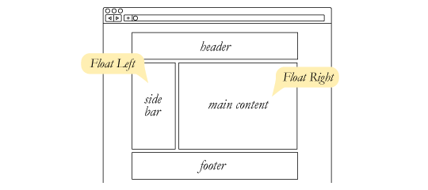
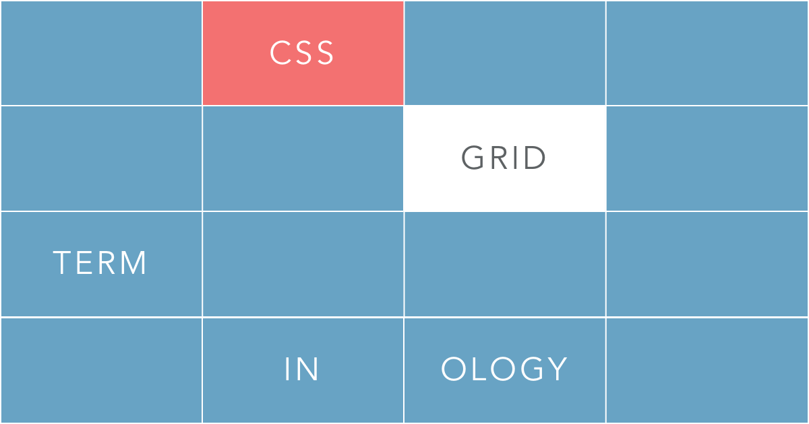
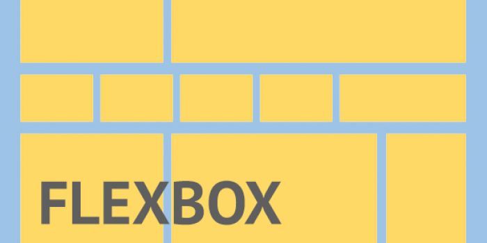

# Layouting

Setelah mempelajari dasar - dasar penggunaan css untuk mempercantik halaman web, sekarang kita akan belajar cara membuat layout dengan menggunakan css

## Metode Layouting dengan CSS

Ada beberapa teknik layouting CSS yang sering digunakan untuk pembuatan halaman web, yaitu :

### 1. Float

Membuat layouting dengan memanfaatkan css float, teknik ini sering digunakan untuk membuat layouting yang sederhana dan merupakan cara yang paling umum digunakan.

CSS float juga dapat mendukung layout yang **responsive** dengan menggunakan teknik yang bernama **12 grid column**, teknik ini sering digunakan pada framework CSS seperti **bootstrap**

**Beberapa referensi untuk belajar layouting dengan css float :**

1. [Dasar CSS Float](https://css-tricks.com/all-about-floats/)
2. [Layouting dengan CSS Float](https://www.youtube.com/playlist?list=PLFIM0718LjIUu4Ju9GUL5zpLcuq08TKYr)
3. [Responsive dengan CSS Float](https://www.w3schools.com/css/css_rwd_grid.asp)

### 2. Grid

CSS grid merupakan layouting yang mudah diterapkan dan merupakan cara yang lebih modern daripada menggunakan float, css grid juga mendukung **responsive design** tanpa perlu teknik khusus

CSS grid menggunakan baris dan kolom untuk membangun design yang terstruktur dan responsive

Walaupun sama - sama mendukung responsive, teknik yang digunakan pada **css grid** dan **12 grid column** sangat **berbeda**

- **12 grid column** menggunakan `float`
- **css grid** menggunakan `display:grid`

Jadi kedua teknik ini **berbeda!**

**Beberapa referensi untuk belajar layouting dengan css grid :**

1. [Dasar CSS Grid](https://css-tricks.com/snippets/css/complete-guide-grid/)
2. [Layouting dengan CSS Grid](https://www.youtube.com/playlist?list=PL4cUxeGkcC9itC4TxYMzFCfveyutyPOCY)

### 3. Flexbox

**Flexbox** (Flexible Box) merupakan cara terbaru untuk melakukan layouting pada web dan mendukung design responsive

Ciri khas dari **flexbox** yaitu kita dapat mendesain layout berdasarkan containernya, sedangkan child elementnya dapat memiliki **size yang berbeda - beda** namun tetap **responsive**, sedangkan **CSS grid** memiliki child yang **size nya sama**

**Flexbox** cocok diterapkan untuk layout yang kecil atau bagian kecil dari aplikasi
**CSS Grid** cocok diterapkan untuk layout yang besar

**Beberapa referensi untuk belajar layouting dengan css grid :**

1. [Dasar CSS Flexbox](https://css-tricks.com/snippets/css/a-guide-to-flexbox/)
2. [Layouting dengan CSS Flexbox](https://www.youtube.com/playlist?list=PL4cUxeGkcC9i3FXJSUfmsNOx8E7u6UuhG)
3. [Cheatsheet flexbox](flexboxsheet.png)
4. [Membuat UI dengan flexbox](https://www.flexboxpatterns.com/)
