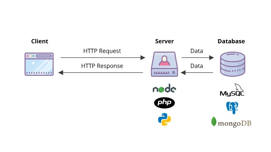
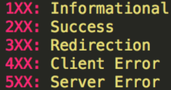

# TOPIK 1 : PENGENALAN PEMROGRAMAN WEB

Disini akan membahas tentang dasar pemrograman web
Topik ini mengambil referensi dari : [https://www.youtube.com/watch?v=D7lpojnH10s](https://www.youtube.com/watch?v=D7lpojnH10s)

## Cara Kerja Website

Sebuah aplikasi web berkomunikasi dengan perangkat lunak client menggunakan protokol HTTP.  HTTP sebagai protokol yang berbicara menggunakan response dan request. Sehingga untuk dapat menghasilkan dokumen yang ingin diakses harus melalui  siklus tersebut :

1. Client mengirim permintaan kepada server dalam bentuk **HTTP request**.
2. Apabila halaman yang diminta memerlukan data, maka server akan meminta data ke database.
3. Database akan mengembalikan data kepada server dalam bentuk JSON / QUERY / XML.
4. Selanjutnya server membungkus data tersebut menjadi HTML dan mengirimkannya kepada klien dalam bentuk **HTTP response**

## HTTP Request dan HTTP Response

HTTP Request dan HTTP Response memiliki struktur sebagai berikut :

###Struktur HTTP Request

**GET** 				: HTTP Verb yang digunakan
**/** 					: path dari halaman yang diakses
**HTTP/1.1** 			: versi HTTP yang digunakan
**example.com:3000** 	: alamat host dan port yang digunakan
**Accept**				: jenis dokumen yang ingin diterima

### Struktur HTTP Response

**HTTP/1.1**			: versi HTTP yang digunakan
**Content-length**		: panjang karakter yang diterima
**Content-Type**		: jenis dokumen yang diterima
**<!DOCTYPE html>...**	: isi dari konten

## HTTP Status Code

**HTTP status code** menunjukkan apakah HTTP Request telah berhasil diselesaikan. 

**HTTP status Code** memiliki beberapa kategori diantaranya :

1. **Informational** ( 100 - 199 )
2. **Successful Responses** (200 - 299 )
3. **Redirection Messages atau something moved** (300 - 399)
4. **Client Error Responses** (400 - 499)
5. **Server Error Responses** (500 - 599).

## HTTP VERBS

**GET** 	: mengambil data dari server (READ)

**POST** 	: membuat data baru (CREATE)

**PUT** 	: mengganti file yang sudah ada dengan file yang baru (UPDATE)

**PATCH** 	: mengupdate atau mengganti file yang sudah ada dengan file yang baru (UPDATE)

**DELETE** 	: Menghapus data (DELETE)

Perintah diatas lebih sering dikenal dengan istilah "**CRUD**".

**tambahan : ** **PUT** lebih sering digunakan daripada **PATCH** apabila berususan dengan updating data