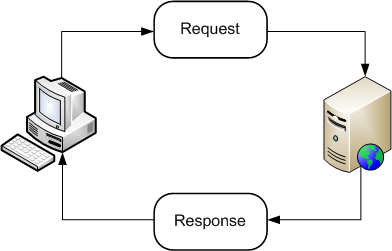

# Request dan Response



## Request

Request berisi data yang dikirimkan oleh client kepada server, biasanya data dikirim dari client lewat URL menggunakan URL Query atau URL Params

### URL Query

#### Penjelasan URL Query

URL query merupakan string yang terletak diakhir sebuah URL yang diawali dengan tanda tanya

```
github.com/?user=wrideveloper&repo=miniclass-web
```

#### Mengambil Data dari URL Query

Kita bisa menggunakan `req.query` untuk mengambil data dari url query

```javascript
app.get('/?user=wrideveloper&repo=miniclass-web', function(req, res) {
  const user = req.query.user
  const repo = req.query.repo
})
```

### URL Params

#### Penjelasan URL Params

Dengan url params kita bisa memasukkan data kedalam URL dengan cara yang lebih rapi daripada dengan menggunakan url query karena kita bisa menentukan sendiri pola url yang kita inginkan

```
github.com/:user/:repo
```

#### Mengambil Data dari URL Params

Kita bisa menggunakan `req.params` untuk mengambil data dari url params

```javascript
app.get('/:user/:repo', function(req, res) {
  const user = req.params.user
  const repo = req.params.repo
})
```

## Response

Response merupakan data yang diberikan oleh server kepada client, pada express kita bisa menggunakan `res.send()` untuk mengirimkan data kepada client

```javascript
app.get('/', function(req, res) {
  res.send('hello world')
})
```
