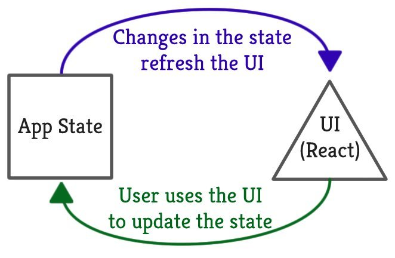

# State

Setelah mempelajari props, maka disini kita akan belajar tentang state

## Perbedaan State dan Props

Sebelumnya kita sudah mengenal props, props merupakan nilai yang diberikan kepada suatu component ketika component tersebut dibuat. Setelah props diterima, maka component tersebut tidak bisa mengubah nilai yang ada di dalam props.

State merupakan data yang sejak awal dimiliki oleh suatu component, berbeda dengan props, nilai dari state ditentukan oleh component itu sendiri. Setelah nilai dari state diinisialisasi oleh suatu component, maka nilai dari state tersebut bisa diubah - ubah oleh component itu sendiri.

## Hubungan State dan Component



State dan component memiliki keterkaitan satu sama lain, yaitu :

1.  Component akan menginisialisasi nilai dari state yang dimilikinya
2.  User akan mentrigger event untuk mengaupdate nilai dari state
3.  Saat nilai dari state berubah, maka component yang memiliki state tersebut akan dirender ulang dengan nilai dari state yang sudah terupdate.

## Cara Menginsialisasi State

Terdapat dua cara untuk menginsialisasi state di dalam component

1.  Apabila kita membuat component menggunakan class, maka gunakan `constructor()` untuk menginisialisasi state

```Javascript
import React, {Component} from 'react'

export default class MyComponent extends Component {

  constructor(props) {
    super(props)
    this.state = {
      state1: 'state1 val',
      state2: 2
    }
  }

  render() {
    return <div>My Component</div>
  }
}
```

2.  Apabila kita membuat component menggunakan `React.createClass` maka gunakan method `getInitialState()` untuk menginisialisasi state

```Javascript
import React from 'react'

var MyComponent = React.createClass({
  getInitialState() {
    return {
      state1: 'state1 val',
      state2: 2
    }
  },
});

export default MyComponent
```

## Cara Mengupdate State

Untuk mengupdate state kita menggunakan method `setState()`

```Javascript
this.setState({// State baru})
```

Setelah kita menjalankan `setState()` maka component tersebut akan langsung dirender ulang secara otomatis

**Untuk memahami lebih lanjut tentang state pada react silahkan kunjungi referensi berikut :**

http://buildwithreact.com/tutorial/state
